# The Quiz Time !

## Introduction
The Quiz Time Website is a site about personality quizzes. It is about testing how you spend your time. That is, how well you manage your time.

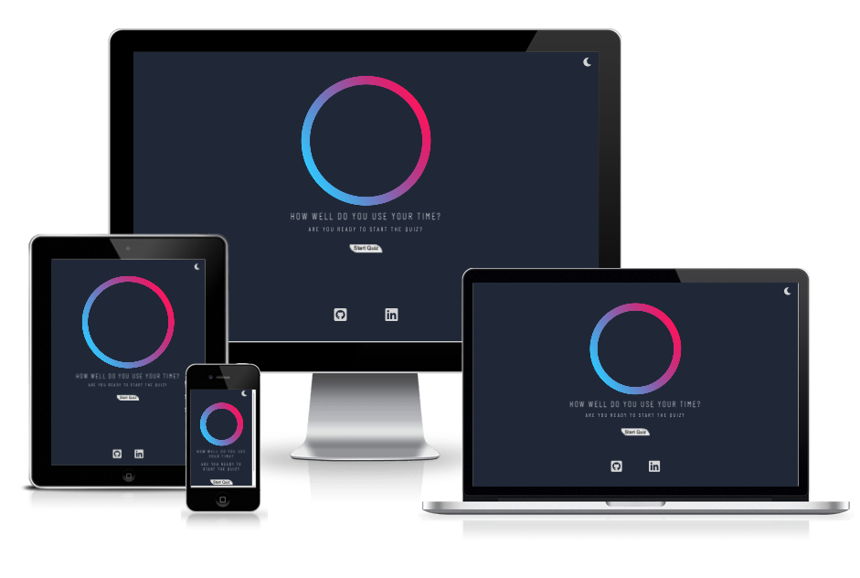

[View the live Website on Github Pages](https://llancruzz.github.io/time-quiz/) Please note: To open any links in this document in a new browser tab, please press CTRL + Click.

## Table Of Contents:
* [UX](#ux)

  * [Quiz Time](#quiz-time)
  * [Colour Palette](#colour-palette)
  * [Wireframe mockups](#wireframe-mockups)
    
* [Features](#features)
 
  * [Common Features](#common-features)
    
    * [Navigation Bar](#navigation-bar)
    * [Hero Image](#hero-image)
    * [Footer](#footer)
    * [Quiz Page](#quiz-page)
    * [Progress Bar](#progress-bar)
    * [Result Page](#result-page)
    * [Feature Testing](#feature-testing)

* [Technologies](#technologies)
 
* [Testing](#testing)
  * [Fixed Issues](#fixed-issues)
  * [Validator Testing](#validator-testing)
    
    * [HTML](#html)
    * [CSS](#css)
    * [Lighthouse](#lighthouse)
    * [WAVE Web Accessibility Evaluation Tool](#wave-web-accessibility-evaluation-tool)

* [Deployment](#deployment)
* [Credits](#credits)
 
  * [Content](#content)
  * [Media](#media)
  

## UX 
### Quiz Time
Quiz Time is a website created for those who want to test their personality according to what they do in everyday life. It is simple and seeks to understand how you spend your time on everyday activities.

### Colour Palette
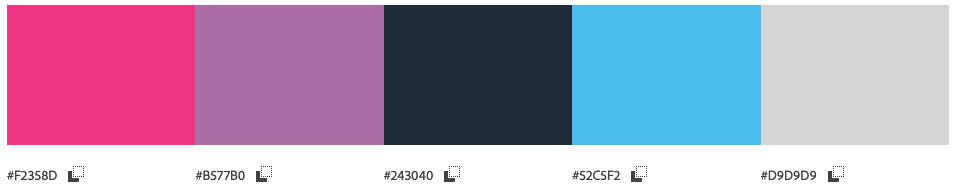

## Wireframe mockups
Initially I utilised Balsamiq to produce low fidelity wireframes to organise the site structure, potential content placement locations.

* [Mobile Wireframe](https://github.com/llancruzz/time-quiz/blob/main/assets/images/mobile.png)
* [Desktop Wireframe](https://github.com/llancruzz/time-quiz/blob/main/assets/images/desktop.png)

## Features

### Common Features 
#### Navigation Bar

  * The navigation bar features a simple design with only a moon symbol for the Dark Theme and a sun symbol for the Light Theme. Therefore, there are two options that the user can choose between them.

 

#### Hero Image

  * Only the home page includes a circle that makes an apology that our lives are based on circles. The main page has two questions. The first one makes the user curious to know what he will know at the end of the quiz. The second asks if he is ready for the quizzes. Just below, there is a button to start the quiz.

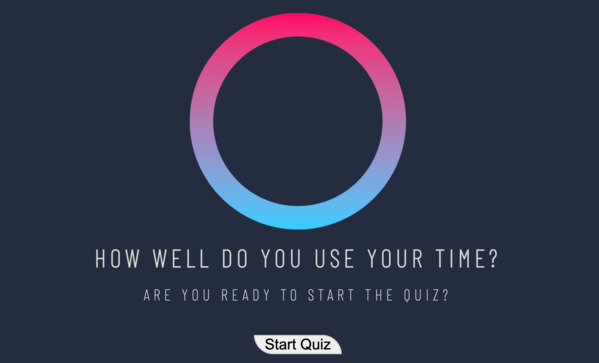

#### Footer
  
  * The lower section of the common footer includes logo links to each of the social media platforms. This provides the user with a visual call to action to prompt them into visiting the social media profiles.
  * These links offer an unintrusive method of promoting the social media channels to the user, providing benefits to the organisation by the way of increased social media following.

#### Quiz Page

  * ....

  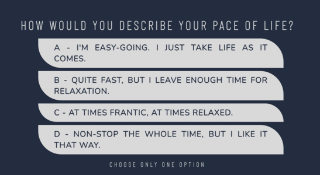

#### Progress Bar

  * ...

  

#### Result Page 

  * .....

  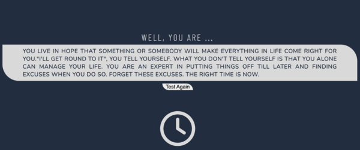

### Feature Testing
 * The process included are as follows:
    * Home : ....
    * Quiz : ....
    * Result : ....

## Technologies
* Technologies / Tools Used

  * 
  * 
  * 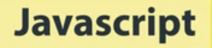
  * 
  * 

## Testing

The website has been tested by friends in different browsers ( Chorme, Firefox, Safari) and in different smarthphones, laptop and desktop. I have personally tested the site extensively with development tools to ensure that the site works responsively not only on mobile devices, but also on medium to large screens. This website is supports by resolutions Desktop(1600x992px and over), Laptop(1280x802px), Tablet(768x1024px), Mobile(320x480px).

### Fixed Issues
  * ......

### Validator Testing
#### HTML

  * No errors were returned when passing through the official W3C Validator.
    
    * [Home Page](https://validator.w3.org/nu/?doc=https%3A%2F%2Fllancruzz.github.io%2Ftime-quiz%2F)
    * [Quiz Page](https://validator.w3.org/nu/?doc=https%3A%2F%2Fllancruzz.github.io%2Ftime-quiz%2Fquiz.html)
    * [Result Page](https://validator.w3.org/nu/?doc=https%3A%2F%2Fllancruzz.github.io%2Ftime-quiz%2Fresult.html)

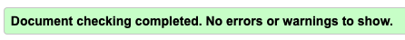

#### CSS

  * No errors were returned when passing through the official (Jigsaw) Validator.

   

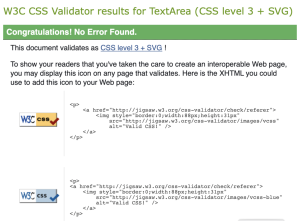

#### JavaScript

  * No erros were returned when passing through the official [JSHInt](https://jshint.com/)

    * Test quiz.js file 

    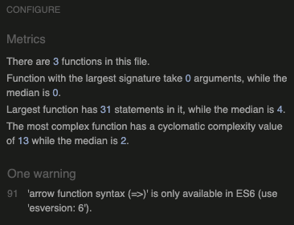

    * Test result.js

    

#### Lighthouse

  * I generated a lighthouse report for the deployed site through the Google Chrome Dev Tools. I generated both a desktop and mobile report. The two reports, both for mobile and desktop, reported that the image sizes were too heavy to load. I redacted the images and turned them into Webp archive by the site [EZGIF.COM](https://ezgif.com/jpg-to-webp) and then I improved the performance score.

    * Mobile  
    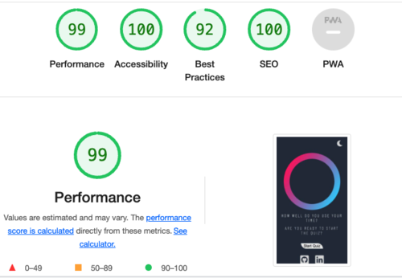

    * Desktop  
    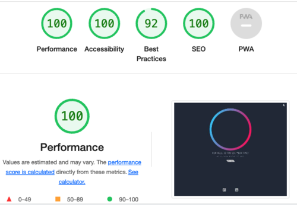)
  
### WAVE Web Accessibility Evaluation Tool

  * I have tested all the pages HOME - QUESTIONS - RESULTS for the following analyses: 

  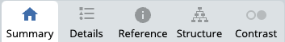

  All the pages no errors were detected! [Link to results](https://wave.webaim.org/report#/https://llancruzz.github.io/time-quiz/)

## Deployment
* The site was deployed to GitHub pages. The steps to deploy are as follows:

  * In the GitHub repository, navigate to the settings tab.
  * Select the pages link from the setting menu on the left hand side.
  * Under the GitHub Pages from the source section drop-down menu, select the master branch.
  * One the master branch has been selected, the page will be automatically refreshed with a detailed ribbon display to indicate the successful deployment.

 The live link can be found here - [The Quiz Time Live Site](https://llancruzz.github.io/time-quiz/)

 ## Credits
 ### Content
  * The logic for all quizzes was created by myself.
  * The reference material on HTML and CSS provided by [w3schools.com](https://www.w3schools.com/) was utilised to implement flexbox and as general reference material for other areas.
  * The logo for footer I used for this project were take from [Font Awesome](https://fontawesome.com/).
  * The materials and ideas utilized in order to create Toogle Theme was found a couple of videos by [Youtube](https://www.youtube.com/).

 ### Media
  * The Favicon, links and meta code were generated by [favicon.io](https://favicon.io/).